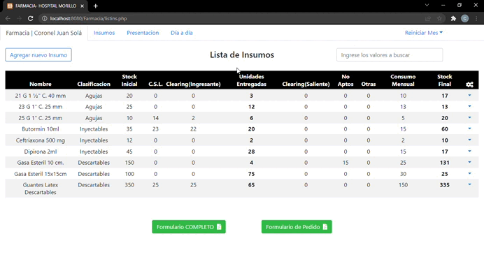

# Proyecto Farmacia Hospital Morillo

**Aplicacion para Control de Stock** Este proyecto fue desarrollado con el fin de llevar un control exacto de insumos en farmacia del hospital de Morillo, instalado en un servidor local con el sistema de gestion Xampp, con bases de datos MySQL  y servidor Apache. Creado en Julio del 2020, como uno de los primeros proyectos trabajando como freelance.

## Instalación

Para instalar la esta aplicacion y ejecutarla deberá seguir los siguientes pasos:

 1. Clonar este repositorio ´git clone https://github.com/carloslobo09/Farmacia-Morillo.git´
 2. Instalar paquete Xampp
 3. Configurar Apache Server en puerto ´8080´
 4. Iniciar Apache y MySQL

## Dependencias
 1. [Bootstrap 3](https://getbootstrap.com/)
 2. [Jquery](https://https://jquery.com/)
 3. [PHP Excel](https://github.com/PHPOffice/PHPExcel)
 4. [XAMPP](https://www.apachefriends.org/es/index.html)

